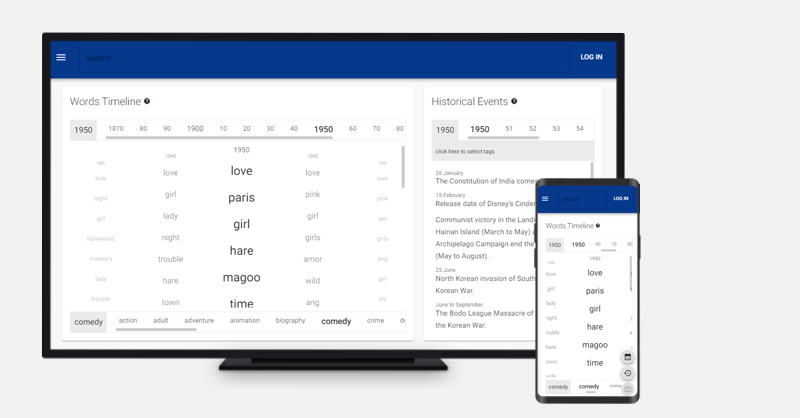

# LABS - React - Web Client 

- [DEMO](https://jmarroyave-compsci.github.io/labs-client-web-react/app/) 
- [Storybook](https://jmarroyave-compsci.github.io/labs-client-web-react/storybook/) 

## Previous versions

| version | site |
|--|--|
| current     | https://jmarroyave-compsci.github.io/labs-client-web-react/app/ |
| 2.x     | https://jmarroyave-compsci.github.io/labs-client-web-react/archive/v.2/ |

## Available Scripts

In the project directory, you can run:

### `npm run dev`

Runs the app in the development mode.\
Open [http://localhost:3000](http://localhost:3000) to view it in the browser.

The page will reload if you make edits.\
You will also see any lint errors in the console.

### `npm run build`

Builds the app for production to the `docs/app` folder.\
It correctly bundles React in production mode and optimizes the build for the best performance.

## Projects Related 

Web Clients:

| Technology | Repo | Site |
|--|--|--|
| react     | [repo](https://github.com/jmarroyave-compsci/labs-client-web-react) | [site](https://jmarroyave-compsci.github.io/labs-client-web-react/app/) |
| angular   | - | - |
| vue       | - | - |

Mobile Clients:

| Technology | Repo | Site |
|--|--|--|
| react-native     | - | - |

Server:

| Technology | Repo | Site |
|--|--|--|
| node-express     | [repo](https://github.com/jmarroyave-compsci/labs-server-node) | [graphql](https://jmarroyave-data-server-01.herokuapp.com/2.0/graphql) |
